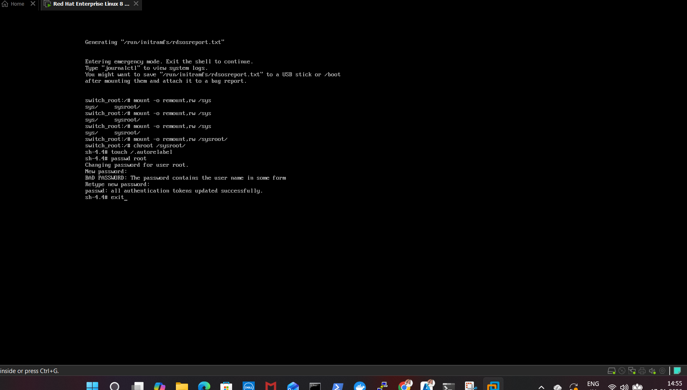
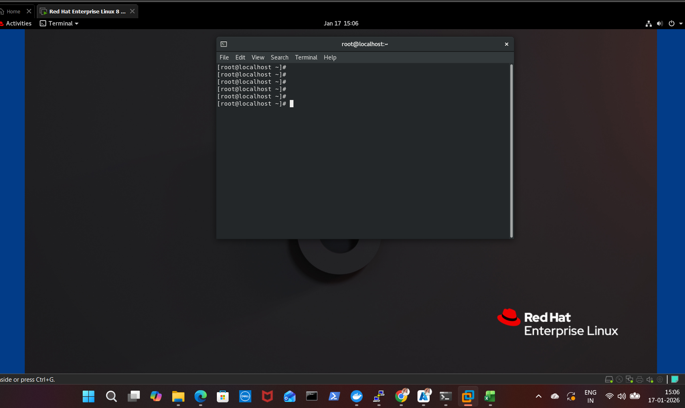

# RHEL 8 – Root Password Reset

## Prerequisites
- Console access to VM
- Disk not encrypted (LUKS)

## Steps

1. Reboot the VM and stop at GRUB  
   

2. Press `e` and append `rd.break` to the linux line  
   

3. Boot with `Ctrl + X`

4. Remount root filesystem and chroot
   ```bash
   mount -o remount,rw /sysroot
   chroot /sysroot


Reset password

passwd root

touch /.autorelabel

Reboot


